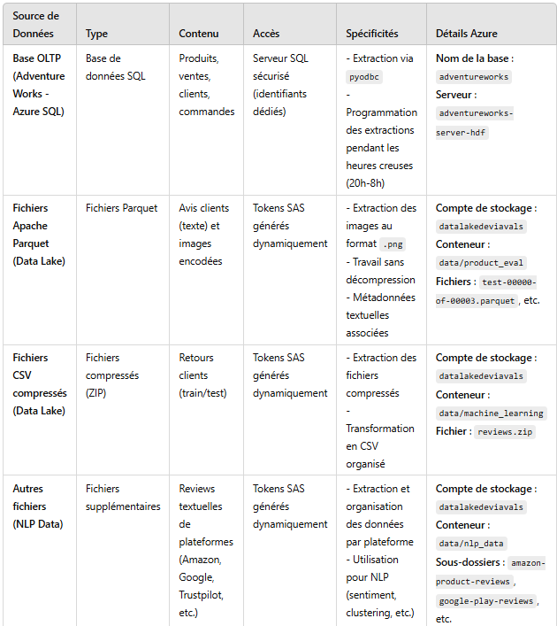

# extraction-multisource

### 📂 Fichiers de données disponibles

#### 1. train.csv
- **Nombre de lignes :** 1,800,000
- **Colonnes :** 
  1. `class` : Classe de l'avis (1 = Négatif, 2 = Positif).
  2. `title` : Titre de l'avis.
  3. `text` : Texte de l'avis.

#### 2. test.csv
- **Nombre de lignes :** 200,000
- **Colonnes :** 
  1. `class` : Classe de l'avis (1 = Négatif, 2 = Positif).
  2. `title` : Titre de l'avis.
  3. `text` : Texte de l'avis.

**Détails sur les classes :**
- Classe 1 (Négatif) : Représente les avis avec des notes 1 ou 2.
- Classe 2 (Positif) : Représente les avis avec des notes 4 ou 5.

---

